```
命令 [选项] [参数]
```

- 命令本身：就是你要执行的操作名称
- 选项：用来调整命令的行为，一般以`-`或`--`开头，比如`-l`、`--help`
- 参数：一般是命令操作的对象，比如文件、目录等

接下来我们逐个讲解常用命令，给你举适合你基础的例子：

### 1. `ls` 列出目录内容

```bash
# 1. 列出当前目录下的文件和文件夹
ls
# 2. 以长格式列出，显示权限、大小、修改时间等详细信息
ls -l
# 3. 显示所有文件，包括隐藏文件（Linux下以.开头的是隐藏文件）
ls -a
# 4. 按文件修改时间排序显示
ls -t
# 5. 显示指定目录下的内容，比如查看/home目录
ls /home
```

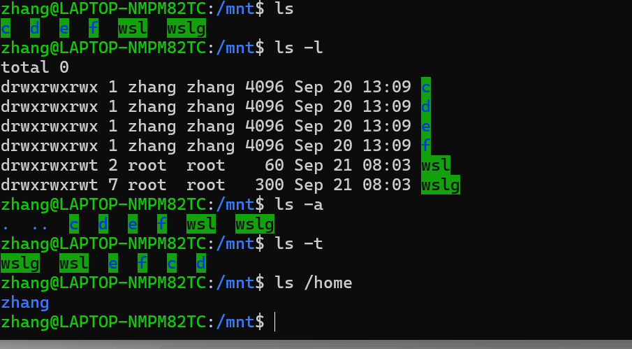

### 2. `who` 查看当前登录系统的用户信息

```bash
# 1. 查看所有当前登录的用户
who
# 2. 只显示当前终端登录的用户名
who am i
# 3. 显示用户登录的标题信息
who -T
# 4. 统计当前登录的用户数量
who -q
```

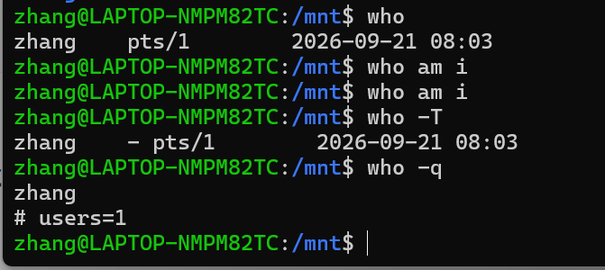

### 3. `pwd` 显示当前所在的工作目录路径

```bash
# 1. 查看当前所在目录的完整路径
pwd
# 2. 如果当前路径是软链接，显示原始链接路径，而非链接指向路径
pwd -P
```

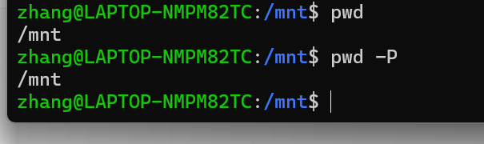

### 4. `cd` 切换当前工作目录

```bash
# 1. 切换到用户主目录
cd ~
# 2. 切换到上一个工作目录
cd -
# 3. 切换到上级目录
cd ..
# 4. 切换到/etc目录
cd /etc
```

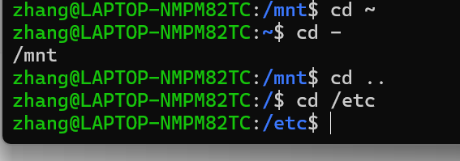

### 5. `man` 查看命令的帮助手册

```bash
# 1. 查看ls命令的帮助手册
man ls
# 2. 查看passwd配置文件的帮助文档（man支持查看配置文件说明）
man 5 passwd
# 3. 退出帮助页面按q即可
```

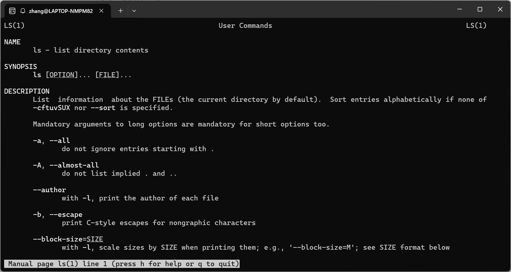

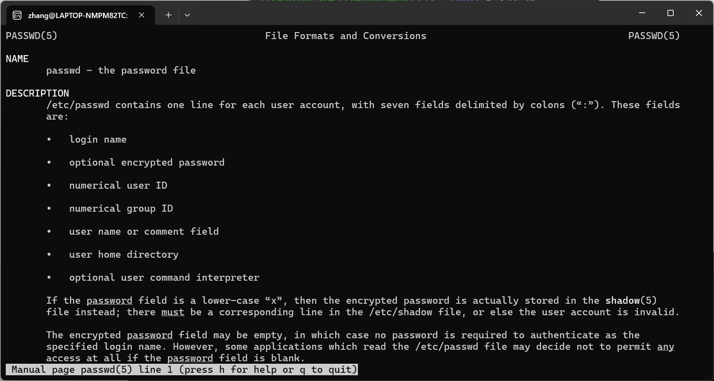

### 6. `whereis` 查找命令的二进制文件、源文件和帮助文档路径

```bash
# 1. 查找ls命令相关文件位置
whereis ls
# 2. 只查找二进制文件
whereis -b ls
# 3. 只查找帮助文档
whereis -m ls
```

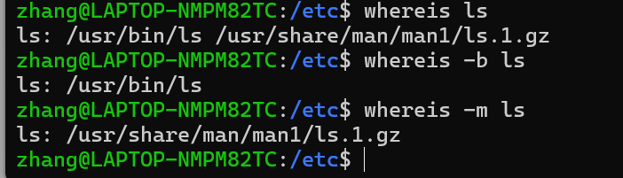

### 7. `which` 查找可执行命令的所在路径

```bash
# 查找python命令的位置
which python3
```

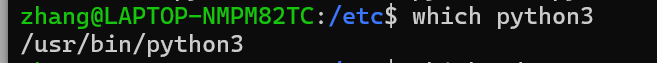

### 8. `find` 在指定目录下查找符合条件的文件

```bash
# 1. 在当前目录查找所有扩展名为.txt的文本文件
find . -name "*.txt"
# 2. 在/etc目录查找所有名称包含passwd的文件
find /etc -name "*passwd*"
# 3. 查找当前目录下所有大于10MB的文件
find . -size +10M
# 4. 查找当前目录下类型是目录的文件
find . -type d
```

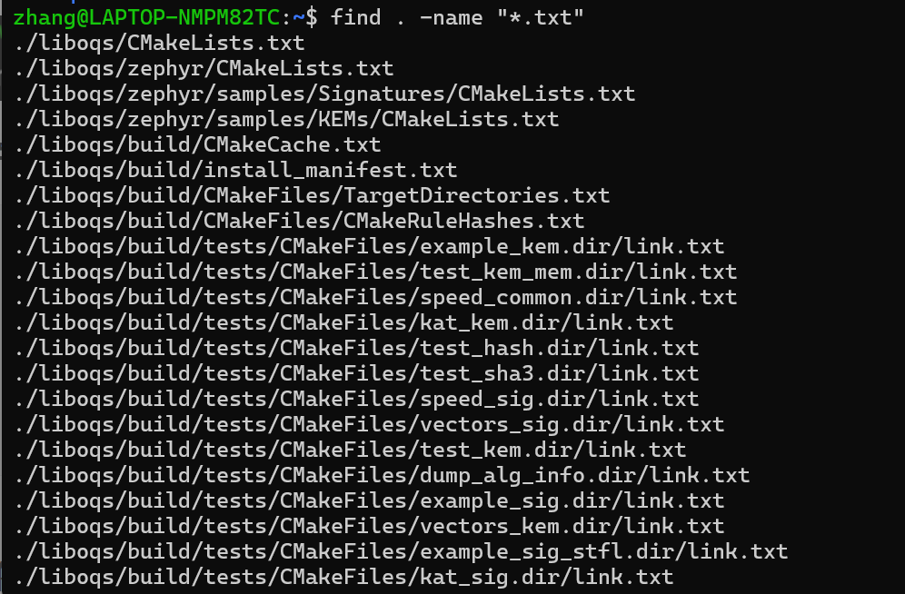

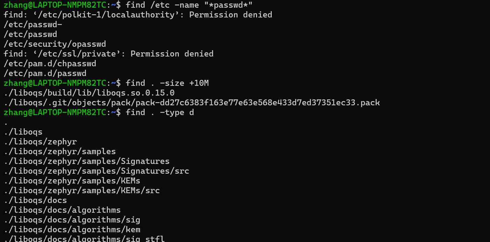


### 9. `grep` 在文件中查找匹配指定模式的文本行

```bash
# 1. 在/etc/passwd文件中查找包含root的行
grep root /etc/passwd
# 2. 不区分大小写查找匹配项
grep -i root /etc/passwd
# 3. 查找匹配时同时显示行号
grep -n root /etc/passwd
# 4. 递归查找目录下所有文件中包含指定内容的行，比如在当前目录找包含hello的行
grep -r "hello" .
```

------

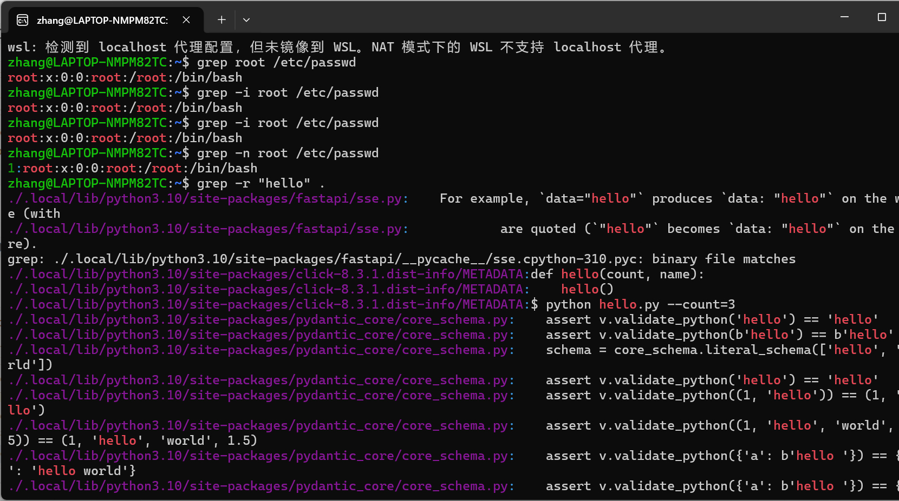

接下来给你推荐三个高频使用的Linux命令，分别是echo、od和sort，给你举几个例子，你也可以自己补充更多用法：

### 重点推荐命令

#### 1. `echo` 输出指定内容，常用于打印变量、输出文本到文件

```bash
# 1. 直接输出指定字符串
echo "Hello Linux"
# 2. 输出环境变量PATH的值
echo $PATH
# 3. 将字符串写入文件，如果文件不存在会创建，存在会覆盖
echo "test content" > test.txt
# 4. 将字符串追加到文件末尾
echo "new line" >> test.txt
```

你可以试试输出你当前的用户名，看看结果是什么。

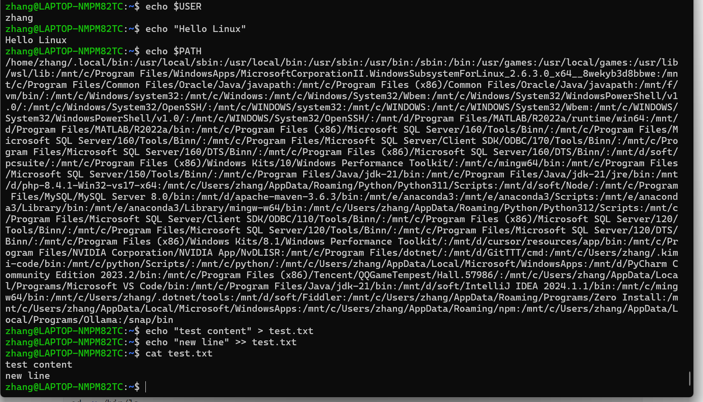

#### 2. `od` 以指定格式查看文件内容，常用于查看二进制文件内容

```bash
# 1. 以八进制和字符格式查看test.txt
od test.txt
# 2. 十六进制格式查看二进制文件
od -x /bin/ls
# 3. 按ASCII字符输出，同时显示偏移地址
od -c test.txt
```

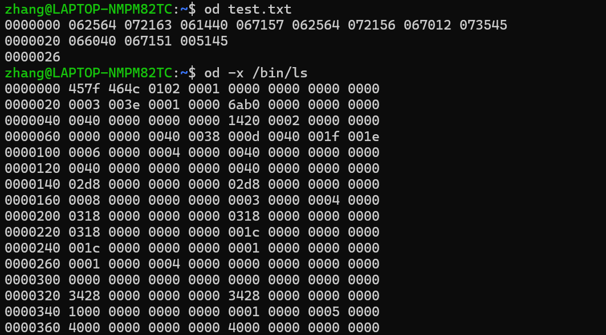

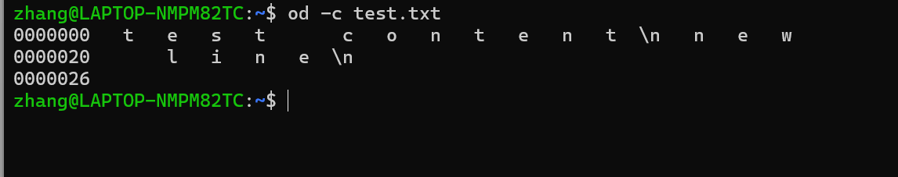

#### 3. `sort` 对文本文件的内容按行排序

```bash
# 1. 默认按字典序排序文本文件
sort names.txt
# 2. 按数字大小排序
sort -n numbers.txt
# 3. 排序后去除重复的行
sort -u words.txt
# 4. 逆序排序
sort -r words.txt
```


